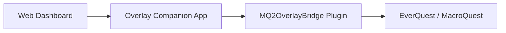

# MQ Overlay Companion — Coming Soon

> **🚧 Work in progress — not a public release.**  
> This repository is a **preview only**. Screenshots and feature descriptions reflect the current private build. **No source code, binaries, or install packages are published here.**

---

## What is it?

**MQ Overlay Companion** is a desktop + browser overlay for [MacroQuest](https://www.macroquest.org/) that gives you one modern dashboard to monitor and control your EverQuest boxes — without digging through a dozen in-game windows and `.ini` files.

Built for **multi-boxers** and **solo power users** who want:

- Live character vitals, target, group, and zone info in one place
- Remote control of macros, plugins, Lua scripts, and MQ commands
- Inventory and loot management with real item icons and stats
- Spawn radar with a zone minimap, navigation helpers, and config editing
- Multi-box roles, broadcast presets, and peer loot routing
- A clean UI that sits beside EQ (or over it in Ghost / Compact mode)

---

## How it works (high level)

1. **Web dashboard** — local browser UI (`http://127.0.0.1:38111/`)
2. **Overlay Companion** — Windows app; hosts the UI, SQLite store, icon atlas, and APIs
3. **MQ2OverlayBridge** — in-game MQ plugin that streams live data and runs commands
4. **Optional data sources** — EZInventory exports, UltDev item catalog, `Loot.ini`, etc.

The companion auto-detects connected EQ clients. Switch boxes from the top bar; every tab follows the selected character.

---

## UI overview

| Group | Tabs |
|-------|------|
| **Character** | Status, Console, Spawns, Inventory, Loot, Nav |
| **Automation** | Boxes, Hotbuttons, Plugins, Macros, Lua |
| **Config** | INI, Settings |

**Global chrome (all tabs):**

- Character mini-card with HP ring, zone, and level
- Per-box character switcher with health dots (`connected` / `degraded` / `no_bridge`)
- Bridge connection status + API version awareness
- **Ctrl+K** command palette (jump to tabs, macros, plugins, or run `/commands`)
- Event feed (loot, tells, alerts, audit)
- **Compact** mode (vitals-only bar) and **Ghost** mode (transparent overlay)

---

## Feature gallery

Screenshots from a live session (July 2026).

---

### 1. Status — command center

- Live vitals: HP, mana, endurance, XP
- Character, level, zone, XYZ position
- Target + group panels (Assist / Follow / Invite helpers)
- **All Boxes** overview cards
- Buffs / songs and casting / gem status
- In-game HUD toggle
- **Per-character alert profiles**: low HP, tells, spawn watch, sound
- Server-side alert events (dashboard toasts even when you were on another tab)
- Send arbitrary MQ commands

---

### 2. Console — live log + history

- Streams in-game / MQ / macro / Lua output over the bridge
- Filter chips: All, Game, Macros, Lua
- Command input with history (↑ / ↓)
- **SQLite history search** across past lines
- **Export** console log to `.txt`
- Color-coded lines (tells, errors, loot, macros)

---

### 3. Spawns — radar + zone minimap

- Live spawn list: name, type, level, distance / bearing
- Search + type filters (NPC / PC / Pet / Merc / Corpse)
- **Zone minimap** — you at center, colored dots for nearby spawns (`dx` / `dy`)
- Click a map dot or list row to **target**
- **Watchlist** — pin mob names; alerts fire in background
- Background spawn polling while other tabs are active

---

### 4. Inventory — icons, stats, sync badges

- Merges **live bridge inventory** + **EZInventory JSON** + **UltDev catalog**
- Native **item icons** from the EQ client atlas
- Stat lines: AC, HP, mana, attributes, resists, heroic, etc.
- Filter chips: All / Worn / Bags / **Bank** / Has stats
- Sync model badges (`EZ` / `CAT`) and **stale export** warnings
- Search by name, slot, or stat

---

### 5. Loot — AdvLoot, corpse, filters, peers

#### Active loot

- Personal + shared AdvLoot with need / greed / leave
- Corpse loot mirror + **Loot All**
- Item icons (bridge + catalog name fallback)
- `Loot.ini` rule badges + quick Keep / Ignore
- Shared loot peer dropdown, Give → peer, Set all shared → peer

#### Loot.ini filters

- Read / write real `Loot.ini` (with `.bak` backup before save)
- Add / update / remove rules (Keep, Ignore, Destroy, Sell, Quest)
- Filter chips + search
- **Export / import** filter templates as JSON

#### Peer assignments

- Default peer for shared AdvLoot
- Per-item peer routes (`loot-peers.json`)
- **Smart suggestions** from box roles + pattern policies
- Peers = connected boxes on your session

---

### 6. Nav — binds, camps, MQ2Nav

- Zone, bind, gate status, live position
- Bind rows with indexed **Gate** / **Succor**
- Camp save / load / delete
- MQ2Nav status badges (Idle / Navigating / Paused)
- Nav Target, Pause, Stop
- **Nav to Loc** (X / Y → `/nav loc`)

---

### 7. Boxes — multi-box crew panel

- Card per connected client: vitals, zone, target, bridge health
- **Roles** per toon (main, puller, looter, healer, …) saved to `boxes.json`
- Crew summary + sort order
- Per-box Follow / Invite / Pause
- Broadcast presets (Camp All, EQBC / DanNet follow+invite, Pause Macros)
- Custom broadcast + **save new presets**
- **Except main** queue — send to all boxes except the main role

---

### 8. Hotbuttons — one-click commands

- Configurable command buttons (multi-step with delays supported)
- Click = run on selected character
- Edit mode: add / delete / **click-to-edit**
- **Categories** with filter chips
- **Per-character hotbutton sets** (Global or named toon)

---

### 9. Plugins — load / unload + INI deep-link

- Loaded vs available plugins with search
- Toggle load / unload (warns when macros depend on a plugin)
- Macro dependency hints (“used by N macro(s)”)
- **INI** button opens the matching config file in the INI editor

---

### 10. Macros — browse, pin, run, edit

- Full `.mac` library with search
- Run / Stop / Pause
- Pin favorites + recent macros
- Missing plugin dependency hints
- **Inline macro editor** — open, edit, save (with backup / conflict check)

---

### 11. Lua — scripts + editor

- Lists scripts from your MQ `lua` folder
- Per-script run / stop toggles + **Stop All**
- Folder grouping + search
- **Inline Lua editor** — open, edit, save

---

### 12. INI — config browser + editor

- Browses MQ `Config` with grouped categories
- Syntax-highlighted editor with line gutter
- Save with **mtime conflict detection** (409 if file changed on disk)
- Automatic `.bak` before overwrite
- Unsaved-change indicator

---

### 13. Settings — appearance, LAN, setup wizard

- Theme / accent / font scale / overlay opacity
- OBS / screen-capture exclude
- **LAN access**: enable, token copy / regenerate, read-only mode, IP allowlist  
  (readonly / allowlist apply live; bind change still needs companion restart)
- Install MQ **autoload** macro
- **Setup Wizard** checklist: bridge connected, DLL present, autoload, LAN, mark done

---

## Cross-cutting systems

| System | What it does |
|--------|----------------|
| **Bridge API v2** | Version handshake; spawn coords, loot icons, richer state |
| **Per-box health** | `connected` / `degraded` / `no_bridge` with reconnect backoff |
| **SQLite store** | Chat history search/export, audit events, spawn snapshots |
| **Audit log** | Loot / INI / broadcast / plugin / macro actions → `companion-audit.jsonl` + Events feed |
| **Inventory sync model** | Bridge = presence; EZInventory = stats when fresh; catalog = icons/names |
| **Loot safety** | `Loot.ini` backups, peer routing, filter templates |
| **Alert engine** | Server-evaluated HP / tell / spawn watch → `/api/alerts/events` |
| **Deploy scripts** | `deploy-overlay.ps1`, `restart-companion.ps1`, `install-overlay.ps1` |

---

## Still coming / not public yet

Honest remaining work before any public beta:

- [ ] Signed installer / updater
- [ ] Full CI publishing pipeline
- [ ] Mobile / hardened remote access beyond LAN token
- [ ] Deeper MQ2Nav path preview / mesh UI
- [ ] Round-robin loot policies at raid scale
- [ ] Performance polish for very large (12+) box crews
- [ ] Public docs beyond this preview

**Expect bugs and breaking changes.** This preview shows direction, not a finished product.

---

## Privacy & repo scope

- **This repo:** screenshots + descriptions only  
- **Not included:** source code, MQ plugin binaries, EQ client assets, or personal configs  
- Built against private MacroQuest / OpenVanilla fork work — **not open-sourced here**

---

## Status

| Area | State |
|------|--------|
| Core bridge pipe + API v2 | ✅ Working in dev |
| Web dashboard UI | ✅ Feature-complete for preview |
| Inventory + icons + sync badges | ✅ Working |
| Loot (active / Loot.ini / peers / policies) | ✅ Working |
| Spawns + zone minimap | ✅ Working (needs bridge reload for coords) |
| Multi-box roles + broadcast | ✅ Working |
| Macro / Lua editors | ✅ Working |
| Setup wizard + LAN | ✅ Working |
| Public release | ❌ Not started |

---

*Last updated: July 2026 — development preview for [eniner/-Coming-Soon-MQ-Companion](https://github.com/eniner/-Coming-Soon-MQ-Companion)*
