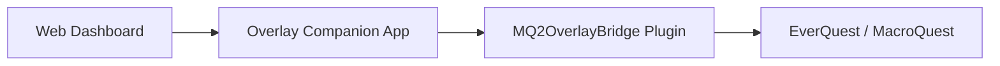

# MQ Overlay Companion — Coming Soon

> **Work in progress — not a public release.**  
> This repository is a **preview only**. Screenshots and feature descriptions reflect the current private build. **No source code, binaries, or install packages are published here.**

---

## What is it?

**MQ Overlay Companion** is a desktop + browser overlay for [MacroQuest](https://www.macroquest.org/) that gives you one modern dashboard to monitor and control your EverQuest boxes — without digging through a dozen in-game windows and `.ini` files.

Built for **multi-boxers** and **solo power users** who want:

- Live character vitals, target, group, buffs, and zone info in one place
- Remote control of macros, plugins, Lua scripts, and MQ commands
- Inventory and loot management with real item icons, stats, and peer routing
- Spawn radar with a pan/zoom zone minimap, watchlists, and con/faction labels
- Multi-box roles, broadcast presets, hotbutton sets, and config portability
- A clean UI that sits beside EQ (or over it in Ghost / Compact / Focus mode)

---

## How it works (high level)

1. **Web dashboard** — local browser UI (`http://127.0.0.1:38111/`)
2. **Overlay Companion** — Windows app; hosts the UI, SQLite store, icon atlas, and APIs
3. **MQ2OverlayBridge** — in-game MQ plugin that streams live data and runs commands (**API v3**)
4. **Optional data sources** — EZInventory exports, UltDev item catalog, `Loot.ini`, etc.

The companion auto-detects connected EQ clients. Switch boxes from the top bar; every tab follows the selected character.

---

## UI overview

| Group | Tabs |
|-------|------|
| **Character** | Status, Console, Spawns, Inventory, Loot, Nav |
| **Automation** | Boxes, Hotbuttons, Plugins, Macros, Lua |
| **Config** | INI, Settings |

**Global chrome (all tabs):**

- Character mini-card with HP ring, zone, level, **role**, and **alert count**
- Per-box character switcher with health dots (`connected` / `degraded` / `no_bridge`)
- Bridge connection status + **API version awareness** (expects bridge v3)
- **Ctrl+K** command palette — tabs, macros, plugins, hotbuttons, watchlist, recent console lines, `/commands`
- Notification center (bell) with history, **mute by category**, and **snooze**
- **Focus** mode, collapsible / icon **Sidebar**, **Compact** vitals bar, **Ghost** overlay (per-element opacity)

---

## What's new in this update

Highlights from the latest product pass (July 2026):

| Area | New |
|------|-----|
| **Information architecture** | Collapsible nav groups, pin tabs, icon-only sidebar, Focus mode, richer status rail |
| **Performance** | Signature-gated list renders, chunked long lists, status subpanel guards, optional perf HUD |
| **Spawns** | Minimap pan / zoom / follow-me / tooltips; con color + faction/race labels; watch channels (toast / sound / both) + match faction |
| **Loot** | Item copper **value**; Settings **auto-greed under copper threshold** with audit “why” |
| **Editors** | Macro / Lua syntax highlight overlay, save line-count confirm, recent files |
| **Hotbuttons** | Drag-to-reorder, import / export JSON, copy set across characters |
| **Boxes** | One-click reconnect + backoff countdown on degraded boxes |
| **Portability** | One-click **config bundle** export / import (hotbuttons, loot peers, boxes, alerts, watchlist, settings) |
| **Session** | On-demand **session summary** — XP/hr, deaths, loot copper, disconnects |
| **Bridge API v3** | Loot `value`, spawn `con` / `faction`, `session_event` metrics streamed to companion |

Everything below from earlier releases is still available.

---

## Feature gallery

Screenshots from a live session (July 10, 2026).

---

### 1. Status — command center

- Live vitals: HP, mana, endurance, XP (smooth bars + HP color ramp)
- Character, level, zone, XYZ position
- Target + group panels (Assist / Follow / Invite helpers)
- **All Boxes** overview cards
- Buffs / songs and casting / gem status
- In-game HUD toggle
- **Per-character alert profiles**: low HP, tells, spawn watch, sound
- Server-side alert events (toasts even when you were on another tab)
- Send arbitrary MQ commands
- Status rail shows **role** + active alert count from any tab

---

### 2. Console — live log + history

- Streams in-game / MQ / macro / Lua output over the bridge
- Filter chips: All, Game, Macros, Lua
- Command input with history
- **SQLite history search** across past lines
- **Export** console log to `.txt`
- Color-coded lines (tells, errors, loot, macros)

---

### 3. Spawns — radar + zone minimap

- Live spawn list: name, type, level, distance / bearing
- **Con color** + **faction / race** labels (bridge API v3)
- Search + type filters (NPC / PC / Pet / Merc / Corpse)
- **Zone minimap** — you at center; pan, zoom, follow-me, hover tooltips
- Click a map dot or list row to **target**
- **Watchlist** — toast / sound / both; optional **match faction/con**
- Background spawn polling while other tabs are active
- Long lists are chunked for overlay performance

---

### 4. Inventory — icons, stats, sync badges

- Merges **live bridge inventory** + **EZInventory JSON** + **UltDev catalog**
- Native **item icons** from the EQ client atlas
- Stat lines: AC, HP, mana, attributes, resists, heroic, etc.
- Filter chips: All / Worn / Bags / **Bank** / Has stats
- Sync model badges (`EZ` / `CAT`) and **stale export** warnings
- Search by name, slot, or stat
- Misconfig coach surfaces stale EZInventory / missing bridge after setup

---

### 5. Loot — AdvLoot, corpse, filters, peers

#### Active loot

- Personal + shared AdvLoot with need / greed / leave
- Corpse loot mirror + **Loot All**
- Item icons (bridge + catalog name fallback)
- **Copper value** when the bridge can resolve it
- `Loot.ini` rule badges + quick Keep / Ignore
- Shared loot peer dropdown, Give → peer, Set all shared → peer
- Optional **auto-greed under copper threshold** (Settings) with audit trail

#### Loot.ini filters

- Read / write real `Loot.ini` (with `.bak` backup before save)
- Add / update / remove rules (Keep, Ignore, Destroy, Sell, Quest)
- Filter chips + search
- **Export / import** filter templates as JSON

#### Peer assignments

- Default peer for shared AdvLoot
- Per-item peer routes (`loot-peers.json`)
- **Auto-assign policies** by role + regex item patterns
- **Smart suggestions** from box roles + pattern policies
- Peers = connected boxes on your session

---

### 6. Nav — binds, camps, MQ2Nav

- Zone, bind, gate status, live position
- Bind rows with indexed **Gate** / **Succor**
- Camp save / load / delete
- MQ2Nav status badges (Idle / Navigating / Paused)
- Nav Target, Pause, Stop
- **Nav to Loc** (X / Y → `/nav loc`)

---

### 7. Boxes — multi-box crew panel

- Card per connected client: vitals, zone, target, bridge health
- **Roles** per toon (main, puller, looter, healer, …) saved to `boxes.json`
- Crew summary + sort order
- Per-box Follow / Invite / Pause
- **One-click reconnect** + visible backoff when degraded
- Broadcast presets (Camp All, EQBC / DanNet follow+invite, Pause Macros)
- Custom broadcast + **save new presets**
- **Except main** queue — send to all boxes except the main role

---

### 8. Hotbuttons — one-click commands

- Configurable command buttons (multi-step with delays supported)
- Click = run on selected character
- Edit mode: add / delete / click-to-edit
- **Drag-to-reorder**
- **Categories** with filter chips
- **Per-character hotbutton sets** (Global or named toon)
- **Import / export JSON** + copy set across characters

---

### 9. Plugins — load / unload + INI deep-link

- Loaded vs available plugins with search
- Toggle load / unload (warns when macros depend on a plugin)
- Macro dependency hints (“used by N macro(s)”)
- **INI** button opens the matching config file in the INI editor

---

### 10. Macros — browse, pin, run, edit

- Full `.mac` library with search
- Run / Stop / Pause
- Pin favorites + recent macros
- Missing plugin dependency hints
- **Inline macro editor** — syntax highlight, edit, save with backup / conflict check + line-count confirm

---

### 11. Lua — scripts + editor

- Lists scripts from your MQ `lua` folder
- Per-script run / stop toggles + **Stop All**
- Folder grouping + search
- **Inline Lua editor** — syntax highlight, edit, save, recent files

---

### 12. INI — config browser + editor

- Browses MQ `Config` with grouped categories
- Syntax-highlighted editor with line gutter
- Save with **mtime conflict detection** (409 if file changed on disk)
- Automatic `.bak` before overwrite
- Unsaved-change indicator

---

### 13. Settings — appearance, loot automation, session, LAN

- Theme / accent / font scale / overlay opacity
- **Ghost panel** + **Ghost feed** opacity (per-element transparency)
- OBS / screen-capture exclude
- Optional **performance HUD**
- **Loot auto-greed copper threshold**
- **Config bundle** export / import (versioned JSON of hotbuttons, loot peers, boxes, alerts, watchlist, settings)
- **Session summary** — XP/hr, deaths, loot copper, disconnects
- **LAN access**: enable, token copy / regenerate, read-only mode, IP allowlist
- Install MQ **autoload** macro
- **Setup Wizard** + ongoing misconfig coach (stale EZInventory, missing DLL, version mismatch)

---

## Cross-cutting systems

| System | What it does |
|--------|----------------|
| **Bridge API v3** | Version handshake; spawn coords + con/faction; loot icons + copper value; session XP/death/loot events |
| **Per-box health** | `connected` / `degraded` / `no_bridge` with reconnect backoff + countdown UI |
| **SQLite store** | Chat history search/export, audit events, spawn snapshots |
| **Audit log** | Loot / INI / broadcast / plugin / macro / reconnect / config → `companion-audit.jsonl` + Events feed |
| **Inventory sync model** | Bridge = presence; EZInventory = stats when fresh; catalog = icons/names |
| **Loot safety** | `Loot.ini` backups, peer routing, filter templates, auto-greed audit “why” |
| **Alert engine** | Server-evaluated HP / tell / spawn watch → `/api/alerts/events` + mute/snooze |
| **Config portability** | Single versioned JSON bundle for sharing setups between machines / boxes |
| **Deploy scripts** | `deploy-overlay.ps1`, `restart-companion.ps1`, `install-overlay.ps1` |

---

## Still coming / not public yet

Honest remaining work before any public beta:

- [ ] Signed installer / updater
- [ ] Full CI publishing pipeline
- [ ] Mobile / hardened remote access beyond LAN token
- [ ] Deeper MQ2Nav path preview / mesh UI
- [ ] True FactionManager standing (today’s `faction` field uses race as a grouping key)
- [ ] Round-robin loot policies at raid scale
- [ ] Further performance polish for very large (12+) box crews
- [ ] Public docs beyond this preview

**Expect bugs and breaking changes.** This preview shows direction, not a finished product.

---

## Privacy & repo scope

- **This repo:** screenshots + descriptions only  
- **Not included:** source code, MQ plugin binaries, EQ client assets, or personal configs  
- Built against private MacroQuest / OpenVanilla fork work — **not open-sourced here**

---

## Status

| Area | State |
|------|--------|
| Core bridge pipe + API v3 | Working in dev |
| Web dashboard UI (IA / Focus / Compact / Ghost) | Working |
| Inventory + icons + sync badges | Working |
| Loot (active / Loot.ini / peers / policies / auto-greed) | Working |
| Spawns + minimap pan/zoom + con/faction | Working |
| Multi-box roles + broadcast + reconnect | Working |
| Macro / Lua editors (highlight + safe save) | Working |
| Config bundle + session summary | Working |
| Setup wizard + LAN + misconfig coach | Working |
| Public release | Not started |

---

*Last updated: July 10, 2026 — development preview for [eniner/-Coming-Soon-MQ-Companion](https://github.com/eniner/-Coming-Soon-MQ-Companion)*
