# MQ Overlay Companion ΓÇö Coming Soon

> **Built for EverQuest emulator only.**  
> Not for Daybreak Live. Not tested on Live. Not supported on Live.  
> Targets **MacroQuest + RoF2-era EQ emulator clients** (private build; public beta zip).  
> Screenshots and docs reflect **bridge API v8** with **EMU hard gates**. Download from [Releases](https://github.com/eniner/-Coming-Soon-MQ-Companion/releases) ΓÇö source remains private.

---

## EverQuest emulator only

**MQ Overlay Companion is intended for, built for, and only for EverQuest emulator.**

| | |
|--|--|
| **Supported** | EverQuest **emulator** clients (RoF2-era EMU) with MacroQuest **Emu** |
| **Not supported** | Daybreak **Live** EverQuest, Test, or any Live client build |
| **Enforced by** | Compile-time ┬╖ plugin init ┬╖ pipe handshake ┬╖ `eqgame.exe` fingerprint ([details](docs/EMU-GATES.md)) |

If you are on Live: **do not install this.** It will not load or connect.

Screenshots below are from a live **EQ emulator** session (Valiant / Guild Lobby) with `MQ2OverlayBridge2` connected.

---

## Download (public beta)

| | |
|--|--|
| **Latest prerelease** | https://github.com/eniner/-Coming-Soon-MQ-Companion/releases/tag/v0.7.0-beta.5 |
| **Zip** | `MQ-Overlay-Companion-0.7.0-beta.5-win32.zip` |
| **Updater manifest** | https://github.com/eniner/-Coming-Soon-MQ-Companion/releases/download/v0.7.0-beta.5/updates.json |
| **Bridge API** | **v8** (EMU handshake required) |

**Install (EMU + MacroQuest only):** expand the zip ? run `scripts\install-overlay.ps1` ? in your EMU client `/plugin MQ2OverlayBridge2` ? open `http://127.0.0.1:38111/`.

Desktop shortcut launches the full companion (stage 5). Brand book-cover icon is embedded for tray/desktop.

**Hide/show overlay:** `Ctrl+Z` ù toggles the **in-game overlay window only** (never your normal browser).

See [Packaging](docs/PACKAGING.md) for Authenticode CI secrets and the updater URL. See [EMU hard gates](docs/EMU-GATES.md) for how Live is blocked.

### What's new in 0.7.0-beta.5
- **Fix:** restore **Ctrl+Z** overlay hide/show and borderless-in-EQ overlay styling
- Ctrl+Z only affects the dedicated overlay `--app` process tree ù not your everyday Edge/Chrome
- Process-tree window find so overlay chrome is applied again (not a plain browser window)

### What's new in 0.7.0-beta.4
- Attempted hotkey isolation (superseded by beta.5)

### From 0.7.0-beta.2 (still included)
- Accent-driven primary buttons; labeled compact vitals; endurance color distinct from HP
- Spawns map legend + facing wedge; side-by-side map/list layout
- Focus mode: Exit Focus button, Esc / Ctrl+Shift+F always works
- Main content scrolls on Windows; larger default window (1280×900); branded icon
- Stale EZInventory badge copies `/lua run ezinventory`; plugin/Lua bulk actions; Ctrl+1ΓÇô9 box hotkeys

---

## What is it?

**MQ Overlay Companion** is a Windows desktop + local browser dashboard for [MacroQuest](https://www.macroquest.org/) on **EverQuest emulator** that gives you one modern control surface for EMU boxes ΓÇö vitals, automation, loot, nav, plugins, macros, Lua, and config ΓÇö without juggling a dozen in-game windows and `.ini` files.

Built for **EMU multi-boxers** and **solo power users** on private / public EQ emulator servers.

---

## How it works

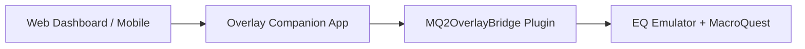

1. **Web dashboard** ΓÇö `http://127.0.0.1:38111/` (+ optional `/mobile.html`)
2. **Overlay Companion** ΓÇö hosts UI, SQLite store, icon atlas, rules/alerts, HTTP APIs
3. **MQ2OverlayBridge** ΓÇö in-game MQ plugin for **EMU** (deployed as `MQ2OverlayBridge2.dll`, **API v8**)
4. **Optional data** ΓÇö EZInventory exports, UltDev item catalog, `Loot.ini`, MQ2Nav / `.navmesh`

The companion auto-detects connected **EQ emulator** clients. Switch boxes from the top bar; every tab follows the selected character.

---

## Full capability list (current private build)

This is everything the product **does and can do today** on **EQ emulator + MacroQuest**.

### Live monitoring & character control
- Live **HP / mana / endurance / XP** bars with color ramps and labeled compact vitals
- Character, level, zone, **XYZ**, role badge, alert count, top-bar **HP ring** (once)
- **Target** + **group** panels (Assist / Follow / Invite helpers)
- **All Boxes** overview cards from any Status view
- Buffs / songs + casting / gem status
- In-game HUD toggle from the dashboard
- Send arbitrary **MQ `/commands`** to the selected box
- Per-character **alert profiles** (low HP, tells, spawn watch, sound)
- Server-side alerts that toast even when you are on another tab
- **Automation rules** on Status: AND conditions → toast / sound / suggest button / broadcast preset / command (per-rule cooldown)

### Console & history
- Live stream of game / MQ / macro / Lua chat over the bridge pipe
- Filter chips: All / Game / Macros / Lua
- Command input + clear
- **SQLite history search** across past lines
- **Export** console log to `.txt`
- Color-coded lines (tells, errors, loot, macros)
- Suggested rule actions can surface as one-click buttons

### Spawns, radar & faction standing (EMU)
- Live spawn list: name, type, level, distance / bearing / facing wedge
- **Con color**, **standing**, **faction / race** labels
- `faction_source`: `faction_table` | `faction_manager` | `consider` | `race_proxy`
- Faction standing without visible `/consider` when FactionTable is available on EMU
- Search + type filters (NPC / PC / Pet / Merc / Corpse)
- **Zone minimap** ΓÇö pan, zoom, follow-me, hover tooltips, **map legend**
- Side-by-side map + list layout
- **Nav path preview** + mesh wireframe (`mesh_mode`: `detour_polys` or `pathexists_tris`)
- Click map/list to **target**
- **Watchlist** ΓÇö toast / sound / both; optional match faction/con
- Background spawn polling (throttled at large crew sizes); chunked lists for perf

### Inventory & gear intel
- Merges **live bridge inventory** + **EZInventory JSON** + **UltDev catalog**
- Native **item icons** from the EQ client atlas
- Stat lines (AC, HP, mana, attributes, resists, heroic, …)
- Filters: All / Worn / Bags / Bank / Has stats + search
- Sync badges (`EZ` / `CAT`) and **stale export** warnings (click-to-copy `/lua run ezinventory`)
- Class / race / level gates for **who can use**
- Feeds loot-row intel: **upgrade Δ**, **redundant** badge

### Loot ΓÇö AdvLoot, corpse, filters, peers, raid council
- Personal + shared AdvLoot (need / greed / leave)
- Corpse loot mirror + **Loot All**
- Item icons + **copper value** when resolvable
- `Loot.ini` rule badges + quick Keep / Ignore
- Shared loot peer dropdown, Give → peer, Set all shared → peer
- Optional **auto-greed under copper threshold** with audit ΓÇ£whyΓÇ¥
- Who-can-use via **multi-pid crew inventory cache**
- **Raid loot council** + rotation (none / round-robin / need-before-greed / DKP ledger) + history
- Full **Loot.ini** editor with `.bak` backup, Keep/Ignore/Destroy/Sell/Quest
- Export / import filter templates as JSON
- Default peer + **regex auto-assign policies** + per-item peer routes

### Navigation (MQ2Nav on EMU)
- Zone / bind / gate status + live position
- Bind rows with indexed **Gate** / **Succor** / Set Bind
- Camp save / load / delete
- MQ2Nav Idle / Navigating / Paused + Nav Target / Pause / Stop
- **Path length / ETA** and failure reasons (plugin missing, no mesh, path blocked, no target)
- **Nav to Loc** (`/nav loc`)
- Spawns minimap: path preview + **Detour `.navmesh` poly dump** (fallback PathExists grid tris)

### Multi-box crew (Boxes)
- Card per connected client: vitals, zone, target, bridge health
- **Roles** per toon (main, puller, looter, healer, …) in `boxes.json`
- Follow / Invite / Pause / **Reconnect** + backoff countdown
- Summary density mode for large crews
- **Crew perf threshold** ΓÇö throttle non-critical polls; at **12+** stagger pipe requests + paginate Boxes
- Broadcast to all / role / except-main
- Broadcast presets (Camp All, EQBC / DanNet follow+invite, Pause Macros) + custom presets
- **Ctrl+1ΓÇô9** box hotkeys
- Loot routing policies by role + regex

### Hotbuttons
- Multi-step command buttons (delays supported)
- Run on selected character; edit / add / delete
- **Drag-to-reorder**, categories, per-character or Global sets
- Import / export JSON + copy set across characters
- Triggerable from automation rules by label

### Plugins
- Loaded vs available with search (full MQ plugin library)
- Toggle load / unload + **Unload all loaded** bulk action
- Macro dependency hints (ΓÇ£used by N macrosΓÇ¥)
- **INI** deep-link into the INI editor
- Dependency graph also in Settings (plugin → macros → hotbuttons)

### Macros
- Full `.mac` library with search, pin, recent
- Run / Stop / Pause
- Missing-plugin dependency hints
- Inline editor: syntax highlight, save with backup / conflict check / line-count confirm

### Lua
- Lists scripts under MQ `lua/` (folder groups)
- Per-script run / stop + **Stop All** / Stop group
- Inline Lua editor: highlight, save, recent files

### INI config browser
- Browses MQ `Config` with grouped categories (KissAssist, MuleAssist, plugins, …)
- Syntax-highlighted editor + line gutter
- Save with **mtime conflict detection** + automatic `.bak`
- Unsaved-change indicator

### Settings, remote, packaging
- Theme / accent / font scale / overlay opacity
- **Ghost** panel + feed opacity; Focus / Compact / Sidebar modes
- Hide dashboard from OBS / screen capture
- Optional **performance HUD** (+ per-box cost)
- Crew perf threshold + Boxes density
- Loot auto-greed copper threshold
- **Config bundle** export / import (versioned JSON)
- **Session summary** ΓÇö XP/hr, deaths, loot copper, disconnects, zones
- **Updates** ΓÇö `/api/version` + Settings check against `updates.json`
- **LAN remote access** ΓÇö master token, allowlist, read-only mode
- **Session tokens** (viewer/control, ~1h) with device label, list, revoke / revoke all, rate limits
- **Mobile viewer** at `/mobile.html`
- Opt-in local usage tips (SQLite only ΓÇö never phones home)
- Setup Wizard + misconfig coach (stale EZInventory, missing DLL, version mismatch)
- Install MQ **autoload** macro
- Packaging scripts + optional Authenticode; CI publish on `overlay-v*` tags

### Cross-cutting systems
| System | Capability |
|--------|------------|
| **Bridge API v8** | Pipe + actor transport; EMU handshake; standing sources; Detour mesh dump; class/item gates |
| **SQLite store** | Chat history, audit, spawn snapshots, loot history, usage tips, rule cooldowns |
| **Audit log** | Loot / INI / broadcast / plugin / macro / reconnect / config / remote → Events |
| **Inventory sync** | Bridge presence + EZ stats + catalog icons + crew cache |
| **Alert + rules engines** | HP / tell / spawn watch + composable rules with cooldown |
| **Deploy helpers** | `deploy-overlay.ps1`, `restart-companion.ps1`, `install-overlay.ps1` |

---

## UI map

| Group | Tabs |
|-------|------|
| **Character** | Status, Console, Spawns, Inventory, Loot, Nav |
| **Automation** | Boxes, Hotbuttons, Plugins, Macros, Lua |
| **Config** | INI, Settings |

**Global chrome:** character mini-card + HP ring, box switcher with health dots, bridge + API version, Ctrl+K palette, notification center (mute / snooze), Focus / Sidebar / Compact / Ghost, remote-access banner when LAN is on, **EQ Emulator only** badge in the sidebar.

---

## Feature gallery (July 11, 2026)

Fresh screenshots from a live **EverQuest emulator** session (Valiant / Guild Lobby, bridge connected) ΓÇö post UI polish pass.

### 1. Status ΓÇö command center

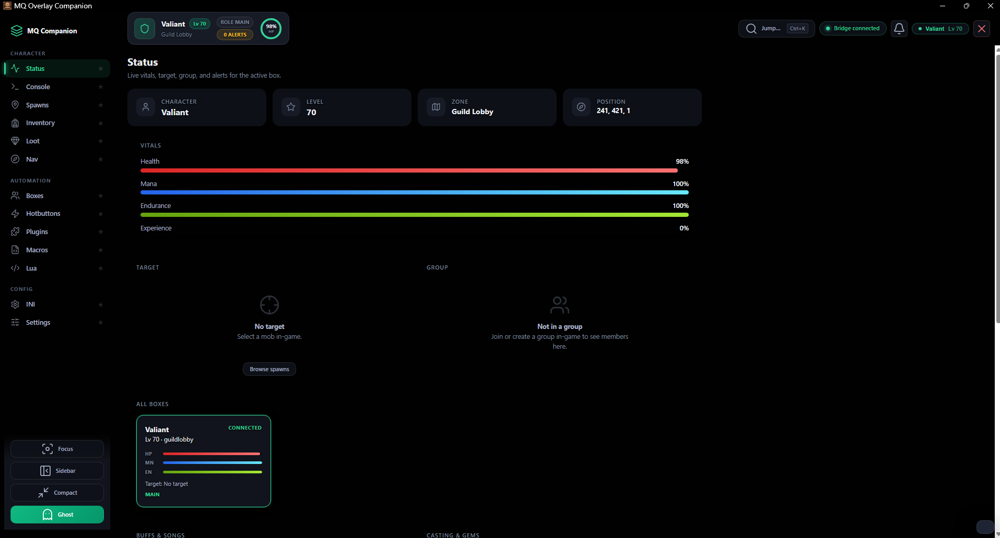

Vitals, identity cards, target/group, All Boxes overview.

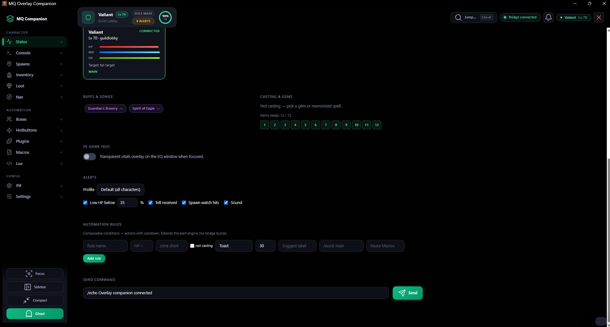

Buffs / gems, in-game HUD toggle, alert profiles, automation rules, send `/command`.

### 2. Console ΓÇö live log + history

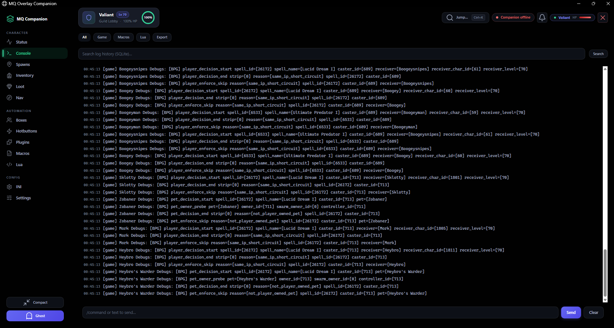

Pipe-connected game/MQ/macro/Lua stream, SQLite search, export, send `/command`.

### 3. Spawns ΓÇö radar + zone minimap

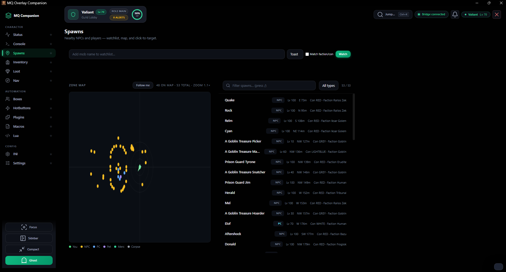

Watchlist, follow-me map with legend, con/standing/faction labels, target-from-list/map.

### 4. Inventory ΓÇö icons, stats, sync

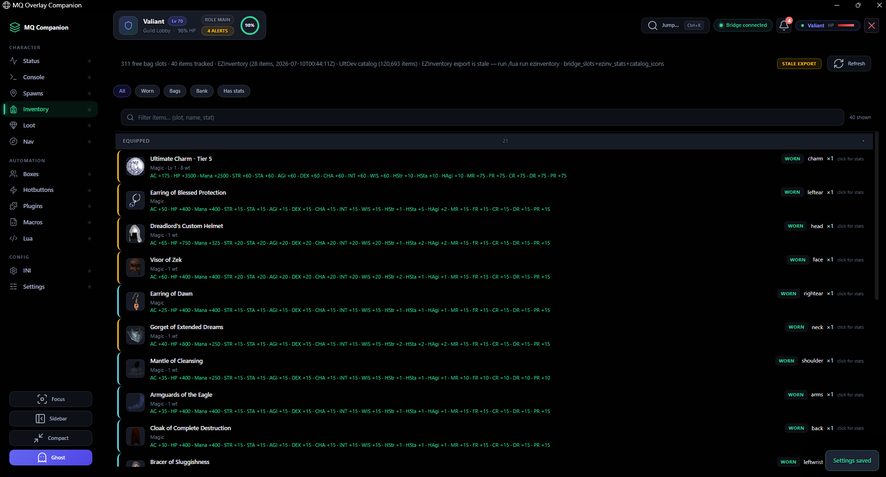

Bridge + EZInventory + UltDev catalog, worn/bags/bank filters, stale-export coach, item icons.

### 5. Loot ΓÇö AdvLoot, filters, peers, council

#### Active loot

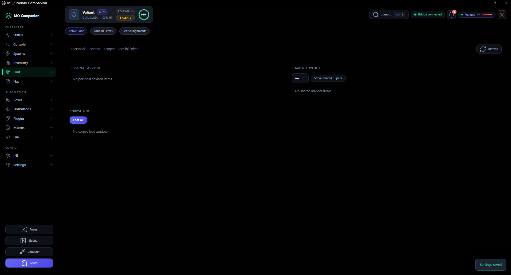

Personal/shared AdvLoot, corpse Loot All, raid rotation / council.

#### Loot.ini filters

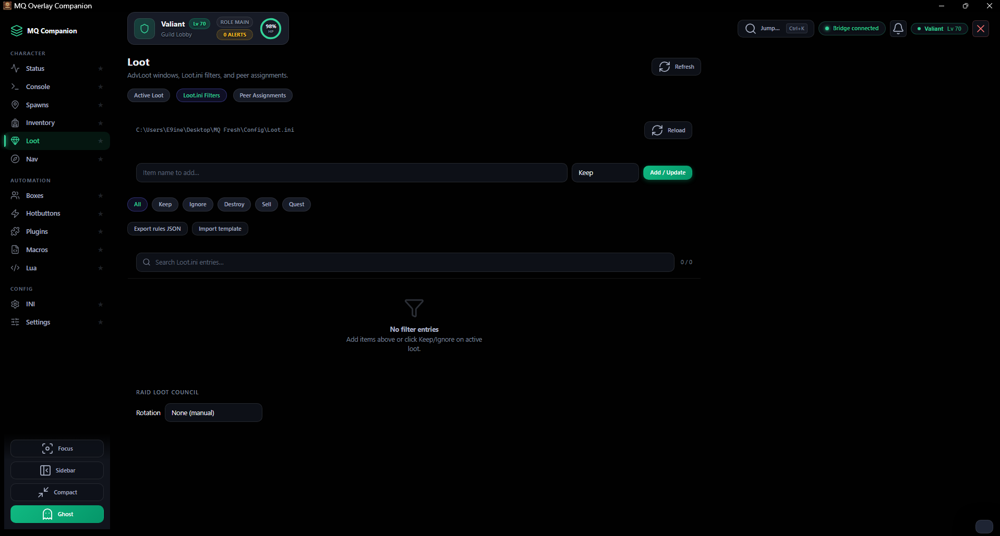

Live `Loot.ini` path, Keep/Ignore/Destroy/Sell/Quest, JSON template import/export.

#### Peer assignments

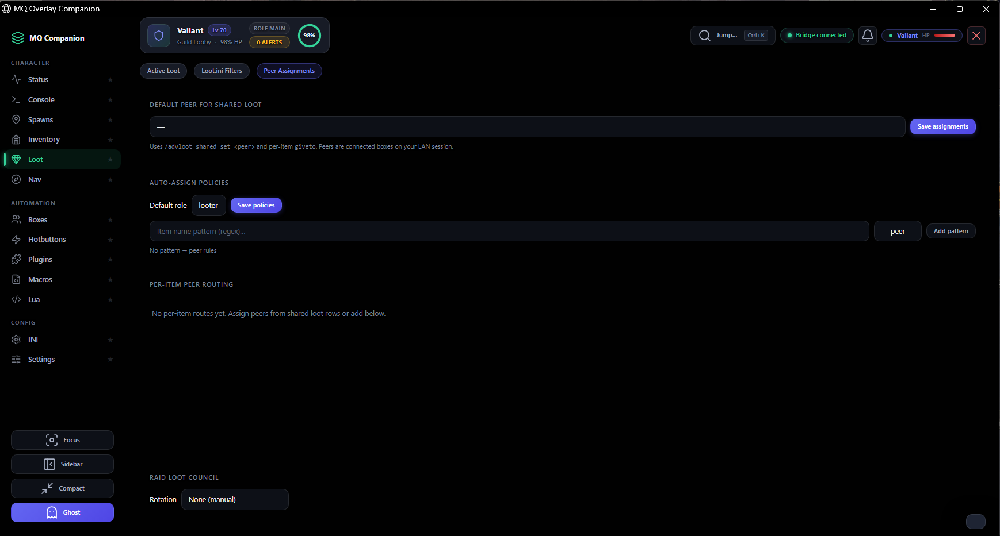

Default shared peer, regex auto-assign by role, per-item routes.

### 6. Nav ΓÇö binds, camps, MQ2Nav

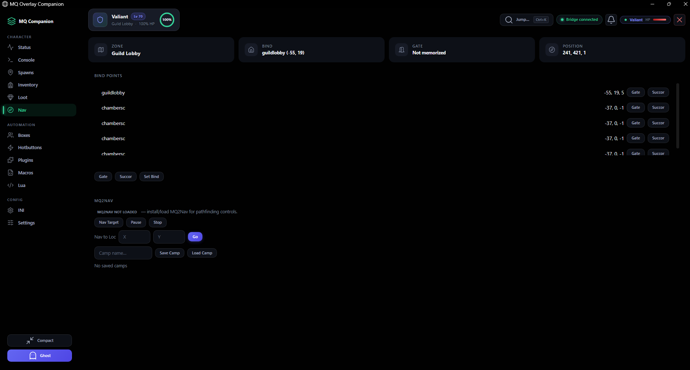

Zone/bind/gate/position, Gate/Succor/Set Bind, Nav Target/Pause/Stop, Nav to Loc, camps.

### 7. Boxes ΓÇö multi-box crew

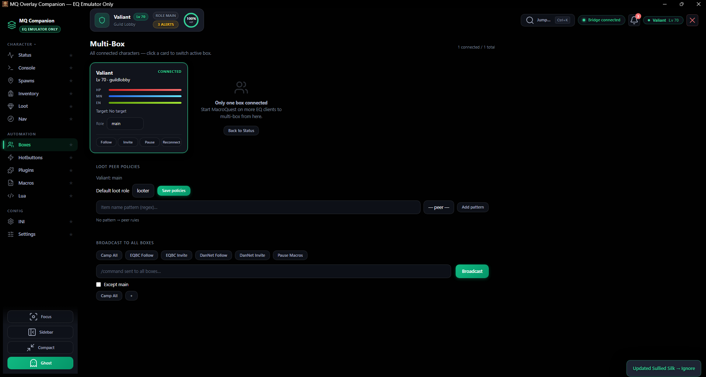

Per-box vitals + role, Follow/Invite/Pause/Reconnect, loot peer policies, broadcast presets + except-main.

### 8. Hotbuttons ΓÇö one-click commands

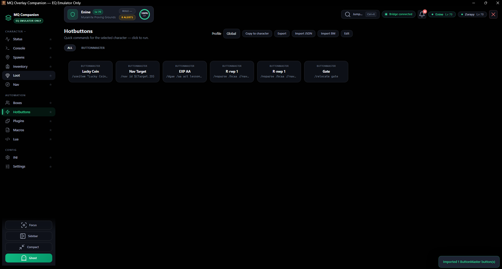

Global/per-character sets, edit/import/export/copy, multi-step commands.

### 9. Plugins ΓÇö load / unload + INI

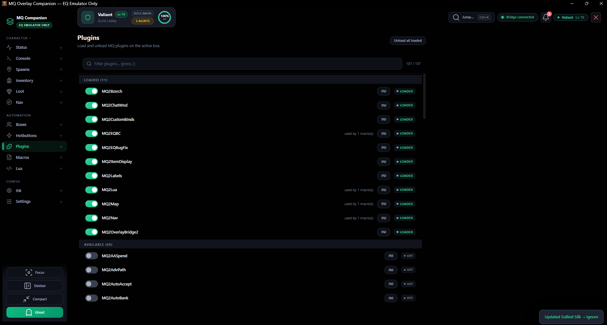

Loaded vs available, dependency hints, Unload all, INI deep-link (includes `MQ2OverlayBridge2`).

### 10. Macros ΓÇö browse, pin, run, edit

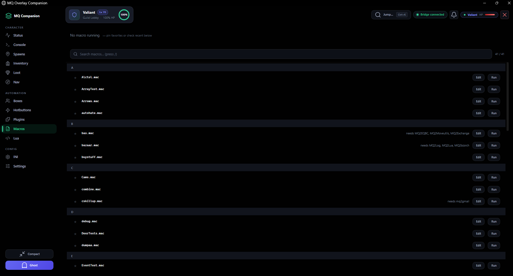

Library search, Run/Edit, missing-plugin dependency notes, inline editor.

### 11. Lua ΓÇö scripts + editor

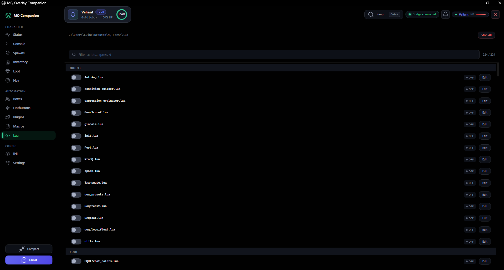

Folder-grouped script library, toggles, Stop All, Edit.

### 12. INI ΓÇö config browser + editor

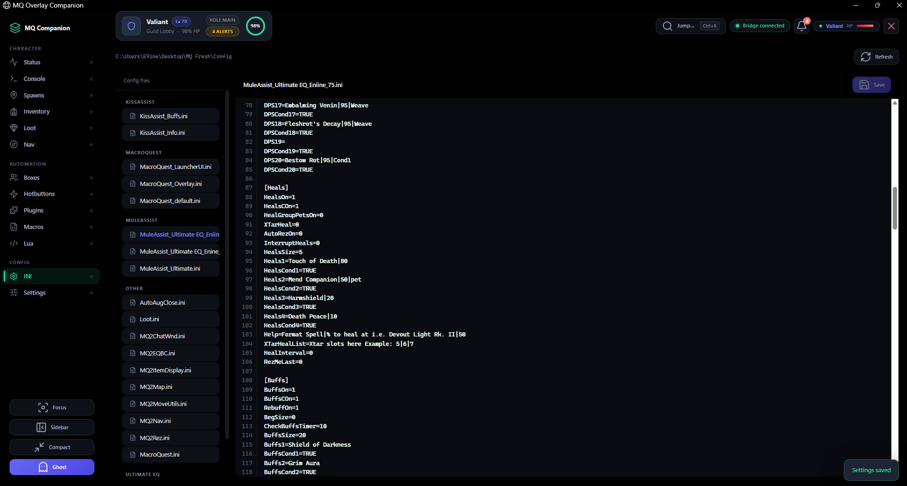

Grouped Config tree (KissAssist, MuleAssist, plugins…), safe save with backups.

### 13. Settings ΓÇö appearance, remote, wizard

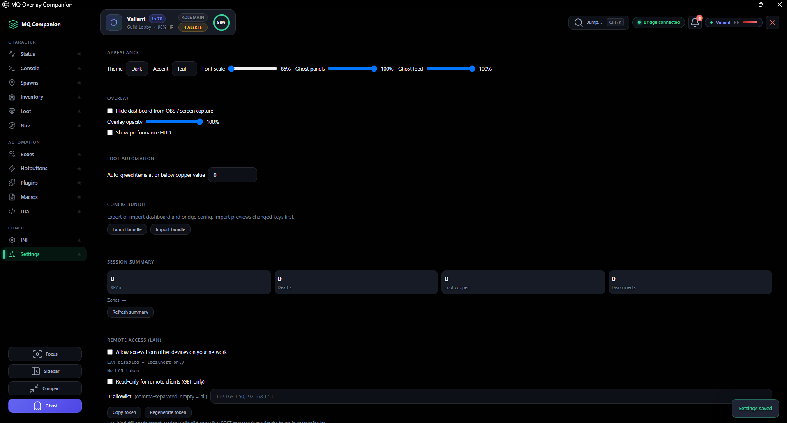

Theme/Ghost/OBS hide, crew perf, auto-greed, config bundle, session summary, updates.

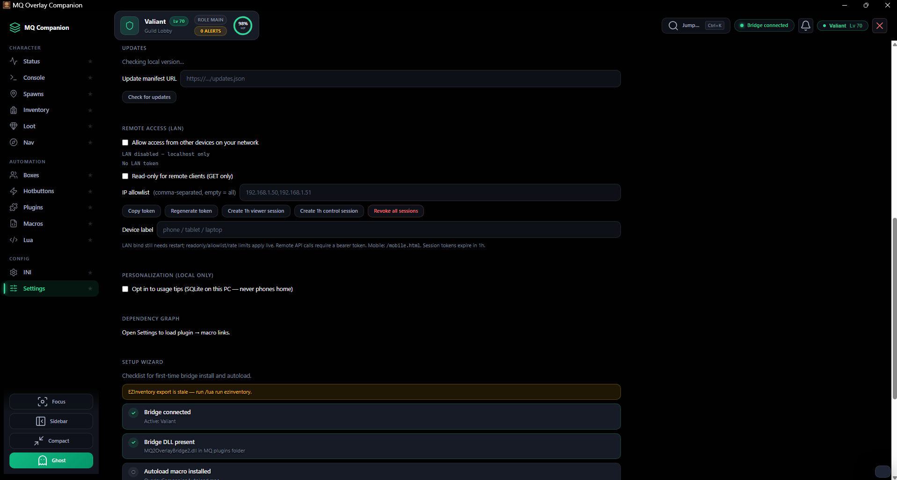

LAN remote access, session tokens, revoke, personalization, Setup Wizard checklist.

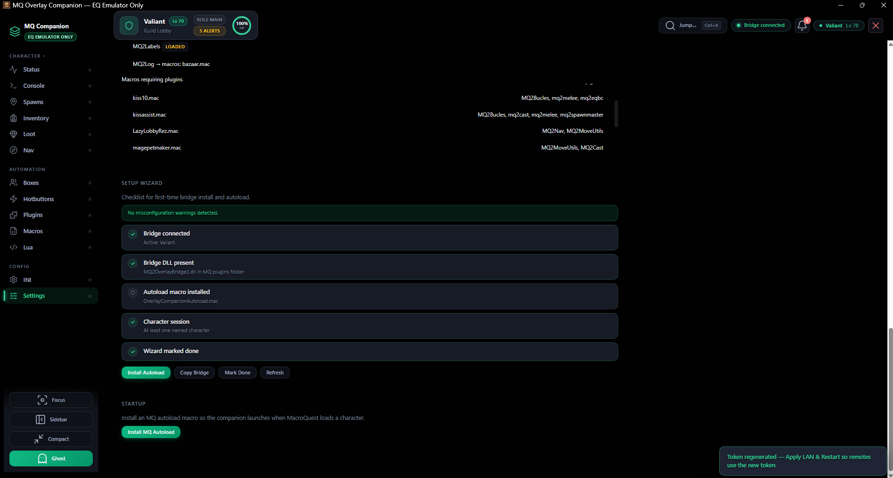

Bridge / DLL / autoload / character session checklist + Install MQ Autoload.

---

## Public docs

- [User Guide](docs/USER-GUIDE.md) ΓÇö install & tabs (**EMU only**)
- [EMU hard gates](docs/EMU-GATES.md) ΓÇö how Live is blocked (compile / init / handshake / fingerprint)
- [API](docs/API.md)
- [Packaging](docs/PACKAGING.md)

---

## Still coming / not public yet

- [ ] Commercial Authenticode cert (DigiCert/Sectigo) replacing interim CI PFX for SmartScreen reputation
- [ ] MSI / Inno Setup wizard (zip + `install-overlay.ps1` ships today)

**Recently shipped (checkbox history):**

- [x] Production code-signing certificate in CI secrets (local sign path + pipeline exist)
- [x] Public beta / installers published to this repo (`v0.7.0-beta.5`)
- [x] UI polish pass (accent, focus exit, scroll, branded icon)
- [x] Fresh screenshots (July 11 EMU gallery above)
- [x] FactionTable / FactionManager standing without visible `/consider` (EMU)
- [x] Native Detour poly dump from MQ2Nav `.navmesh`
- [x] PathExists triangle wireframe fallback
- [x] Signed installer / updater scaffolding + CI publish path
- [x] Hardened remote auth (revoke UI, rate limits, mobile)
- [x] Multi-pid inventory cache / who-can-use
- [x] 12+ box crew performance polish
- [x] Public User Guide + API docs
- [x] Explicit **EverQuest emulator only** product positioning
- [x] EMU hard gates: compile-time, plugin init, handshake, eqgame fingerprint (`v0.7.0-beta.3`)
- [x] Overlay toggle hotkey fixed: `Ctrl+Shift+O` (no more global `Ctrl+Z`) (`v0.7.0-beta.5`)

**Expect bugs and breaking changes.** This preview shows direction, not a finished product.

---

## Privacy & repo scope

- **This repo:** screenshots + descriptions + public docs only  
- **Not included:** source code, MQ plugin binaries, EQ client assets, or personal configs  
- Built against private MacroQuest / OpenVanilla fork work for **EQ emulator** ΓÇö **not open-sourced here**
- Usage tips / personalization stay **local SQLite only** ΓÇö nothing is phoned home

---

## Status

| Area | State |
|------|--------|
| Target platform | **EQ emulator + MacroQuest only** |
| Daybreak Live | **Not supported** |
| Core bridge pipe + API **v8** + EMU gates | Working in EMU dev |
| Web dashboard (Focus / Compact / Ghost) | Working |
| Automation rules + alerts | Working (preview) |
| Inventory + icons + crew who-can-use | Working |
| Loot (AdvLoot / Loot.ini / peers / council) | Working |
| Spawns + Detour/PathExists mesh + path preview | Working |
| FactionTable / consider standing (EMU) | Working |
| Multi-box roles + broadcast + 12+ perf | Working |
| Macros / Lua / Plugins / Hotbuttons / INI | Working |
| Config bundle + session summary + updater check | Working |
| Remote tokens + revoke + mobile | Working (preview) |
| Packaging + CI publish path | Working (preview) |
| Public docs | Working |
| Setup wizard + misconfig coach | Working |
| Public release | Not started |

---

*Last updated: July 11, 2026 ΓÇö v0.7.0-beta.5 Ctrl+Shift+O overlay toggle fix ΓÇö [eniner/-Coming-Soon-MQ-Companion](https://github.com/eniner/-Coming-Soon-MQ-Companion)*
