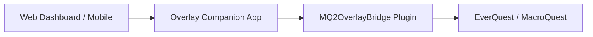

# MQ Overlay Companion — Coming Soon

> **Work in progress — not a public release.**  
> This repository is a **preview only**. Screenshots and feature descriptions reflect the current private build. **No source code, binaries, or install packages are published here.**

---

## What is it?

**MQ Overlay Companion** is a desktop + browser overlay for [MacroQuest](https://www.macroquest.org/) that gives you one modern dashboard to **monitor, control, and automate** your EverQuest boxes — without digging through a dozen in-game windows and `.ini` files.

Built for **multi-boxers** and **solo power users** who want:

- Live character vitals, target, group, buffs, casting/gems, and zone info in one place
- Remote control of macros, plugins, Lua scripts, hotbuttons, and MQ commands
- **Composable automation rules** (conditions → toast / sound / suggest / broadcast / command) with cooldowns
- Inventory and loot with real item icons, stats, copper value, peer routing, **raid loot council / rotation**, and upgrade intel
- Spawn radar with a pan/zoom zone minimap, watchlists, con/standing/faction labels, and **PathExists triangle mesh + nav path preview** (bridge **v6**)
- Multi-box roles, broadcast presets, crew health / reconnect, and **12+ box performance modes** (staggered polls, paginated Boxes)
- Config portability (bundle export/import), session summary (XP/hr, deaths, loot copper), and SQLite history
- A clean UI beside EQ — **Focus / Compact / Ghost** — plus optional **LAN + mobile viewer** with **session revoke UI**, rate limits, and **update checks** (`/mobile.html`)

It is **not** a public release product yet. This repo only documents the private build’s direction.

---

## How it works (high level)

1. **Web dashboard** — local browser UI (`http://127.0.0.1:38111/`); optional **mobile** view at `/mobile.html`
2. **Overlay Companion** — Windows app; hosts the UI, SQLite store (chat/audit/loot history/usage), icon atlas, rules engine, and HTTP APIs
3. **MQ2OverlayBridge** — in-game MQ plugin that streams live data and runs commands (**API v6**)
4. **Optional data sources** — EZInventory exports, UltDev item catalog, `Loot.ini`, MQ2Nav TLOs, etc.

The companion auto-detects connected EQ clients. Switch boxes from the top bar; every tab follows the selected character. When LAN is enabled, a persistent banner shows remote access is on; short-lived **viewer/control session tokens** can be issued, listed, and revoked for phones or other devices.

---

## UI overview

| Group | Tabs |
|-------|------|
| **Character** | Status (vitals + **automation rules**), Console, Spawns, Inventory, Loot (**council**), Nav |
| **Automation** | Boxes (crew perf / density), Hotbuttons, Plugins (**deps**), Macros, Lua |
| **Config** | INI, Settings (session, remote, tips, perf) |

**Global chrome (all tabs):**

- Character mini-card with HP ring, zone, level, **role**, and **alert count**
- Per-box character switcher with health dots (`connected` / `degraded` / `no_bridge`)
- Bridge connection status + **API version awareness** (expects bridge **v6**)
- **Ctrl+K** command palette — tabs, macros, plugins, hotbuttons, watchlist, recent console lines, `/commands`
- Notification center (bell) with history, **mute by category**, and **snooze**
- **Focus** mode, collapsible / pin / icon **Sidebar**, **Compact** vitals bar, **Ghost** overlay (per-element opacity)
- Persistent **Remote access ON** banner when LAN is enabled (+ `/mobile.html` viewer)

---

## Today's updates (July 11, 2026 — installer / CI / standing / mesh)

| Area | Today |
|------|--------|
| **Signed installer / updater** | `packaging/build-release.ps1` → zip + `updates.json` + optional **Authenticode** (`OV_SIGN_THUMBPRINT` / signtool); Settings **Check for updates** via `/api/version` + remote manifest |
| **CI publishing pipeline** | `.github/workflows/overlay-companion.yml` — Win32 build, package artifacts, **GitHub Release** on `overlay-v*` tags |
| **Faction standing** | Parse `/consider` chat → ALLY…SCOWLING cache; auto-consider target; `faction_source:"consider"` when known (FactionManager offsets still unmapped) |
| **Mesh wireframe** | 9×9 PathExists grid → **`mesh_tris` / `mesh_edges`** on minimap (`mesh_mode: pathexists_tris`). Full Detour poly dump still needs MQ2Nav internals |

**Bridge:** companion expects **API v6**. Reload: `/plugin MQ2OverlayBridge2`.

---

## Earlier today (still-coming pass → API v5)

| Area | Shipped |
|------|--------|
| **Hardened remote auth** | Device/session list + revoke; rate limits; remote bearer for `/api/*` |
| **Nav mesh (v5)** | PathExists rings + PathLength ETA |
| **Faction fields** | `standing` / `faction_source` + class on state/items |
| **Crew inventory cache** | `GET /api/inventory/crew` for who-can-use |
| **12+ crew polish** | Staggered polls + paginated Boxes |
| **Public docs** | [User Guide](docs/USER-GUIDE.md) + [API](docs/API.md) |

---

## Earlier (July 10, 2026 — Round 2)

Shipped on top of the earlier July upgrade pass:

| Area | Round 2 |
|------|--------|
| **Automation rules** | Visual rules builder on Status — composable conditions (HP, zone, not casting, …) → actions (toast, sound, suggest button, broadcast preset, command) with per-rule cooldown (`rules.json`) |
| **Raid-scale loot** | Rotation modes: none / round-robin / need-before-greed+history / simple DKP ledger; **loot council** (pending across boxes, who’s next); loot history API |
| **12+ box performance** | Crew perf threshold (throttles spawn polling at scale); Boxes **summary density**; perf HUD **per-box cost** breakdown |
| **Nav depth (bridge v4)** | Path preview + mesh sample ring on minimap; **failure reasons** (MQ2Nav missing, no mesh, path blocked); ETA / distance |
| **Remote beyond static LAN** | Short-lived **viewer/control session tokens** (1h); scoped permissions; `/mobile.html` read-only vitals/alerts + safe loot leave; remote banner |
| **Loot / inventory intel** | “Who can use”, **redundant** badge, worn-slot **upgrade Δ** on loot rows |
| **Dependency graph** | Settings panel: plugin → macros that use it (answer “what breaks if I unload this?”) |
| **Personalization (opt-in)** | Local SQLite usage tips — **never phones home**; toggle in Settings |

---

## Earlier (Round 1 — still available)

| Area | New |
|------|-----|
| **Information architecture** | Collapsible nav groups, pin tabs, icon-only sidebar, Focus mode, richer status rail |
| **Performance** | Signature-gated list renders, chunked long lists, status subpanel guards, optional perf HUD |
| **Spawns** | Minimap pan / zoom / follow-me / tooltips; con color + faction/race labels; watch channels (toast / sound / both) + match faction |
| **Loot** | Item copper **value**; Settings **auto-greed under copper threshold** with audit “why” |
| **Editors** | Macro / Lua syntax highlight overlay, save line-count confirm, recent files |
| **Hotbuttons** | Drag-to-reorder, import / export JSON, copy set across characters |
| **Boxes** | One-click reconnect + backoff countdown on degraded boxes |
| **Portability** | One-click **config bundle** export / import |
| **Session** | On-demand **session summary** — XP/hr, deaths, loot copper, disconnects |
| **Bridge API v3** | Loot `value`, spawn `con` / `faction`, `session_event` metrics (nav fields added in v4) |

Everything in the feature gallery below includes Round 1, Round 2, and the July 11 still-coming pass.

---

## Feature gallery

Screenshots from a live session (July 10, 2026). Gallery images predate the July 11 auth/mesh/crew-cache pass; descriptions below include the **current** feature set.

---

### 1. Status — command center

- Live vitals: HP, mana, endurance, XP (smooth bars + HP color ramp)
- Character, level, zone, XYZ position
- Target + group panels (Assist / Follow / Invite helpers)
- **All Boxes** overview cards
- Buffs / songs and casting / gem status
- In-game HUD toggle
- **Per-character alert profiles**: low HP, tells, spawn watch, sound
- Server-side alert events (toasts even when you were on another tab)
- Send arbitrary MQ commands
- Status rail shows **role** + active alert count from any tab
- **Automation rules** builder — AND conditions (HP below, zone is, not casting, …) → toast / sound / suggest action button / broadcast preset / command, with cooldown

---

### 2. Console — live log + history

- Streams in-game / MQ / macro / Lua output over the bridge
- Filter chips: All, Game, Macros, Lua
- Command input with history
- **SQLite history search** across past lines
- **Export** console log to `.txt`
- Color-coded lines (tells, errors, loot, macros)
- Suggested rule actions can surface here as one-click buttons in the event feed

---

### 3. Spawns — radar + zone minimap

- Live spawn list: name, type, level, distance / bearing
- **Con color** + **standing** (consider-chat when known) / **faction** / **race** (`faction_source`: `consider` | `race_proxy`)
- Search + type filters (NPC / PC / Pet / Merc / Corpse)
- **Zone minimap** — you at center; pan, zoom, follow-me, hover tooltips
- **Nav path preview** + **PathExists triangle wireframe** (`mesh_tris` / `mesh_edges`) when bridge **v6** is loaded
- Click a map dot or list row to **target**
- **Watchlist** — toast / sound / both; optional **match faction/con**
- Background spawn polling while other tabs are active (**throttled** when crew size ≥ perf threshold)
- Long lists are chunked for overlay performance

---

### 4. Inventory — icons, stats, sync badges

- Merges **live bridge inventory** + **EZInventory JSON** + **UltDev catalog**
- Native **item icons** from the EQ client atlas
- Stat lines: AC, HP, mana, attributes, resists, heroic, etc.
- Filter chips: All / Worn / Bags / **Bank** / Has stats
- Sync model badges (`EZ` / `CAT`) and **stale export** warnings
- Search by name, slot, or stat
- Misconfig coach surfaces stale EZInventory / missing bridge after setup
- Feeds loot-row intel (upgrade Δ / redundant) when comparing worn gear

---

### 5. Loot — AdvLoot, corpse, filters, peers, raid council

#### Active loot

- Personal + shared AdvLoot with need / greed / leave
- Corpse loot mirror + **Loot All**
- Item icons (bridge + catalog name fallback)
- **Copper value** when the bridge can resolve it
- `Loot.ini` rule badges + quick Keep / Ignore
- Shared loot peer dropdown, Give → peer, Set all shared → peer
- Optional **auto-greed under copper threshold** (Settings) with audit trail
- Loot row intel: **who can use** (class + level via multi-pid crew inventory cache) / **redundant** badge / worn-slot **upgrade Δ**
- **Raid loot council** + rotation policies (round-robin, need-before-greed, DKP ledger) + history — auto-batch clear decisions; surface conflicts for a human

#### Loot.ini filters

- Read / write real `Loot.ini` (with `.bak` backup before save)
- Add / update / remove rules (Keep, Ignore, Destroy, Sell, Quest)
- Filter chips + search
- **Export / import** filter templates as JSON

#### Peer assignments

- Default peer for shared AdvLoot
- Per-item peer routes (`loot-peers.json`)
- **Auto-assign policies** by role + regex item patterns
- **Smart suggestions** from box roles + pattern policies
- Peers = connected boxes on your session

---

### 6. Nav — binds, camps, MQ2Nav

- Zone, bind, gate status, live position
- Bind rows with indexed **Gate** / **Succor**
- Camp save / load / delete
- MQ2Nav status badges (Idle / Navigating / Paused)
- **Path / ETA** (PathLength when available) and **failure reasons** when nav can’t run (no plugin, no mesh, path blocked, no path to target)
- **PathExists** reachable sample rings on the Spawns minimap (bridge **v5**)
- Path preview also draws on the Spawns minimap
- Nav Target, Pause, Stop
- **Nav to Loc** (X / Y → `/nav loc`)

---

### 7. Boxes — multi-box crew panel

- Card per connected client: vitals, zone, target, bridge health
- **Roles** per toon (main, puller, looter, healer, …) saved to `boxes.json`
- Crew summary + sort order
- Per-box Follow / Invite / Pause
- **One-click reconnect** + visible backoff when degraded
- **Summary density** mode for large crews (expand on demand)
- **Crew perf threshold** — above N boxes, non-critical polls throttle; at **12+** companion also **staggers** bridge requests and the UI **paginates** the Boxes grid
- Broadcast command to all / role / except-main
- **Broadcast presets** (Camp All, EQBC / DanNet follow+invite, Pause Macros) + save new presets
- Loot routing **policies** by role + regex patterns
- **Except main** queue — send to all boxes except the main role

---

### 8. Hotbuttons — one-click commands

- Configurable command buttons (multi-step with delays supported)
- Click = run on selected character
- Edit mode: add / delete / click-to-edit
- **Drag-to-reorder**
- **Categories** with filter chips
- **Per-character hotbutton sets** (Global or named toon)
- **Import / export JSON** + copy set across characters
- Can be triggered from **automation rules** by label

---

### 9. Plugins — load / unload + INI deep-link + deps

- Loaded vs available plugins with search
- Toggle load / unload (warns when macros depend on a plugin)
- Macro dependency hints (“used by N macro(s)”)
- **INI** button opens the matching config file in the INI editor
- Full **dependency graph** also available under Settings (plugin → macros → hotbuttons)

---

### 10. Macros — browse, pin, run, edit

- Full `.mac` library with search
- Run / Stop / Pause
- Pin favorites + recent macros
- Missing plugin dependency hints
- **Inline macro editor** — syntax highlight, edit, save with backup / conflict check + line-count confirm

---

### 11. Lua — scripts + editor

- Lists scripts from your MQ `lua` folder
- Per-script run / stop toggles + **Stop All**
- Folder grouping + search
- **Inline Lua editor** — syntax highlight, edit, save, recent files

---

### 12. INI — config browser + editor

- Browses MQ `Config` with grouped categories
- Syntax-highlighted editor with line gutter
- Save with **mtime conflict detection** (409 if file changed on disk)
- Automatic `.bak` before overwrite
- Unsaved-change indicator

---

### 13. Settings — appearance, loot, session, remote, tips

- Theme / accent / font scale / overlay opacity
- **Ghost panel** + **Ghost feed** opacity (per-element transparency)
- OBS / screen-capture exclude
- Optional **performance HUD** (+ **per-box cost** breakdown)
- **Crew perf threshold** + Boxes density (cards / summary)
- **Loot auto-greed copper threshold**
- **Config bundle** export / import (versioned JSON of hotbuttons, loot peers, boxes, alerts, watchlist, settings)
- **Session summary** — XP/hr, deaths, loot copper, disconnects
- **LAN access**: enable, token copy / regenerate, read-only mode, IP allowlist
- **Session tokens** (1h viewer/control) with **device label**, **active session list**, **revoke** / **revoke all**, remote **rate limits**
- **Mobile view** at `/mobile.html` (token persisted locally)
- **Dependency graph** (plugins ↔ macros)
- Opt-in **local usage tips** (SQLite only — never phones home)
- Links to public preview docs ([User Guide](docs/USER-GUIDE.md), [API](docs/API.md))
- Install MQ **autoload** macro
- **Setup Wizard** + ongoing misconfig coach (stale EZInventory, missing DLL, version mismatch)

---

## Cross-cutting systems

| System | What it does |
|--------|----------------|
| **Bridge API v6** | v5 + PathExists tris/edges, consider-based standing, version handshake |
| **Packaging / CI** | Release zip + `updates.json`; optional Authenticode; GitHub Actions publish on `overlay-v*` |
| **Updater** | `/api/version` + Settings check against hosted `updates.json` |
| **Per-box health** | `connected` / `degraded` / `no_bridge` with reconnect backoff + countdown UI |
| **SQLite store** | Chat history, audit, spawn snapshots, loot history, usage tips, rule cooldowns |
| **Audit log** | Loot / INI / broadcast / plugin / macro / reconnect / config / remote → Events feed |
| **Inventory sync model** | Bridge = presence; EZInventory = stats when fresh; catalog = icons/names; **crew cache** for cross-box intel |
| **Loot safety** | `Loot.ini` backups, peer routing, filter templates, auto-greed audit, raid rotation/council |
| **Rules engine** | Composable conditions → actions with cooldown (extends alert engine) |
| **Alert engine** | Server-evaluated HP / tell / spawn watch → `/api/alerts/events` + mute/snooze |
| **Config portability** | Single versioned JSON bundle for sharing setups between machines / boxes |
| **Remote access** | LAN master token + scoped session tokens + list/revoke UI + rate limits + mobile viewer |
| **Crew perf mode** | Throttle + stagger non-critical polls; paginate Boxes above large crew sizes |
| **Deploy scripts** | `deploy-overlay.ps1`, `restart-companion.ps1`, `install-overlay.ps1` |

---

## Still coming / not public yet

Honest remaining work before any public beta:

- [ ] Code-signing certificate in CI secrets (pipeline + local sign path exist; production cert not checked in)
- [ ] FactionManagerClient offsets for standing without `/consider` (consider-chat standing ships today)
- [ ] Native Detour/Recast poly dump via MQ2Nav internals (PathExists triangle wireframe ships today)
- [ ] Fresh screenshots that show Round 2 + July 11 UI (rules, council, revoke list, mesh tris, mobile, updater)

**Shipped from the previous “still coming” list:**

- [x] Signed installer / updater scaffolding (zip + optional Authenticode + Settings update check)
- [x] Full CI publishing pipeline (build → artifact → tagged GitHub Release)
- [x] True faction standing via consider parse + auto-consider (`faction_source:"consider"`)
- [x] Mesh triangle/edge wireframe from PathExists grid
- [x] Hardened remote auth (device revocation UI, rate limits polish)
- [x] PathExists mesh beyond decorative sample ring
- [x] Standing / faction_source fields + class/item gates for who-can-use
- [x] Deeper multi-pid inventory cache for cross-box “who can use”
- [x] Further performance polish for very large (12+) box crews
- [x] Public docs beyond this preview ([User Guide](docs/USER-GUIDE.md), [API](docs/API.md))

**Expect bugs and breaking changes.** This preview shows direction, not a finished product.

---

## Privacy & repo scope

- **This repo:** screenshots + descriptions + public docs only  
- **Not included:** source code, MQ plugin binaries, EQ client assets, or personal configs  
- Built against private MacroQuest / OpenVanilla fork work — **not open-sourced here**
- Usage tips / personalization stay **local SQLite only** — nothing is phoned home

---

## Status

| Area | State |
|------|--------|
| Core bridge pipe + API **v6** | Working in dev |
| Web dashboard UI (IA / Focus / Compact / Ghost) | Working |
| Automation rules engine | Working (preview) |
| Inventory + icons + sync badges | Working |
| Loot (active / Loot.ini / peers / raid council / auto-greed) | Working |
| Spawns + PathExists triangle mesh + path preview | Working (v6 bridge) |
| Consider-based faction standing | Working (preview) |
| Multi-box roles + broadcast + reconnect + crew perf (12+) | Working |
| Macro / Lua editors (highlight + safe save) | Working |
| Config bundle + session summary | Working |
| Remote session tokens + revoke UI + rate limits + mobile | Working (preview) |
| Multi-pid inventory cache / who-can-use | Working |
| Installer package + updater check + CI publish | Working (preview) |
| Public docs (user guide + API) | Working ([docs/](docs/)) |
| Setup wizard + LAN + misconfig coach | Working |
| Public release | Not started |

---

*Last updated: July 11, 2026 (installer/CI/standing/mesh → GitHub preview) — development preview for [eniner/-Coming-Soon-MQ-Companion](https://github.com/eniner/-Coming-Soon-MQ-Companion)*
