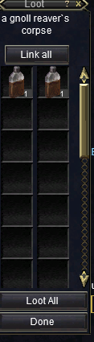
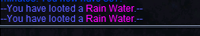
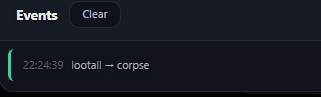

# MQ Overlay Companion — Coming Soon

> **⚠️ Work in progress — not remotely done.**  
> This repository is a **preview only**. Screenshots and feature descriptions reflect current development on a private build. **No source code, binaries, or install packages are published here.**

---

## What is it?

**MQ Overlay Companion** is a desktop + browser overlay for [MacroQuest](https://www.macroquest.org/) that gives you one modern dashboard to monitor and control your EverQuest boxes — without digging through a dozen in-game windows and `.ini` files.

It is built for **multi-boxers** and **solo power users** who want:

- Live character vitals, target, group, and zone info in one place
- Remote control of macros, plugins, Lua scripts, and MQ commands
- Inventory and loot management with real item icons and stats
- Spawn lists, navigation helpers, and config editing from the overlay
- A clean UI that can sit beside EQ (or over it in Ghost mode)

---

## How it works (high level)

1. **Web dashboard** — runs locally in your browser (`http://127.0.0.1:…`)
2. **Overlay Companion** — small Windows app; hosts the UI, icon atlas, and APIs
3. **MQ2OverlayBridge** — in-game MQ plugin that streams live data and runs commands
4. **Optional data sources** — EZInventory exports, UltDev item catalog, `Loot.ini`, etc.

The companion auto-detects connected EQ clients (no hardcoded character names). Switch boxes from the top bar; every tab follows the selected character.

---

## UI overview

The sidebar is grouped into three areas:

| Group | Tabs |
|-------|------|
| **Character** | Status, Console, Spawns, Inventory, Loot, Nav |
| **Automation** | Boxes, Hotbuttons, Plugins, Macros, Lua |
| **Config** | INI, Settings |

**Global features** (visible across tabs):

- Character mini-card with HP ring, zone, and level
- Per-box character switcher
- Bridge connection status
- **Ctrl+K** command palette (jump to any tab/action)
- Event feed (loot actions, tells, alerts)
- **Compact** mode (vitals-only bar) and **Ghost** mode (transparent overlay)

---

## Feature preview (in sidebar order)

Screenshots below are from a live dev session. Functionality varies by tab — many areas are stubbed, partial, or still being wired up.

---

### 1. Status — character command center

**What it does (so far):**

- Live vitals: HP, mana, endurance, XP bars
- Character, level, zone, and XYZ position
- Target and group panels (populate when in-game state exists)
- **All Boxes** overview — quick vitals for every connected client
- Buffs / songs list and casting / gem status
- Optional in-game HUD toggle (transparent vitals on the EQ window)
- Alert profiles: low HP, tells, spawn watch, sound
- Send arbitrary MQ commands (`/echo`, `/cast`, etc.)

**WIP / gaps:** Some panels show placeholders when not grouped or not targeting. Alert delivery and HUD polish are ongoing.

---

### 2. Console — game log + command line

**What it does (so far):**

- Streams in-game console output over the bridge pipe
- Filter chips: All, Game, Macros, Lua
- Bottom command input — send `/commands` to the active box
- Clear log buffer

**WIP / gaps:** Log filtering rules and history search are basic. No log export yet.

---

### 3. Spawns — nearby NPC / PC radar

**What it does (so far):**

- Live spawn list with name, type, level, and distance
- Search / filter (`/` focus shortcut)
- Type filter dropdown
- **Watchlist** — pin mob names for alerts (ties into Status alerts)

**WIP / gaps:** No map dots yet. Watchlist → alert wiring is early.

---

### 4. Inventory — icons, stats, and bag tracking

**What it does (so far):**

- Merges **live bridge inventory** + **EZInventory JSON export** + **UltDev catalog** 
- Native **item icons** cropped from EQ client atlas
- Full stat lines: AC, HP, mana, attributes, resists, heroic, etc.
- Slot labels (worn, bags), quantity, magic flag
- Filter/search and refresh
- Hints when EZInventory export is missing (`/lua run ezinventory`)

**WIP / gaps:** Bank/bag drill-down grouping still improving. Some items rely on catalog fallback until bridge reload.

---

### 5. Loot — AdvLoot, corpse loot, filters, and peers

Loot is split across several sub-views and in-game tie-ins.

#### 5a. Active Loot (dashboard)

**What it does (so far):**

- **Personal** and **shared** AdvLoot lists with need / greed / leave actions
- **Corpse loot** window mirror with per-slot loot and **Loot All**
- Item icons (bridge + catalog by name fallback)
- `Loot.ini` rule badges (Keep / Ignore / etc.) on each row
- Quick **Keep** / **Ignore** buttons write back to `Loot.ini`
- Shared loot: peer dropdown, **Give → peer**, **Set all shared → peer**

#### 5b. In-game corpse window (reference)

The dashboard corpse section mirrors this native loot window (e.g. gnoll reaver corpse → Rain Water icons).

#### 5c. In-game loot chat + event log

Loot actions from the dashboard show up in-game and in the companion **Events** feed (`lootall → corpse`, etc.).

#### 5d. Loot.ini Filters

**What it does (so far):**

- Reads / writes your real `Loot.ini` path
- Add or update entries (Keep, Ignore, Destroy, Sell, Quest)
- Filter chips and search across entries
- Reload from disk

**WIP / gaps:** Bulk import/export and rule templates not built yet.

#### 5e. Peer Assignments (multi-box shared loot)

**What it does (so far):**

- Default peer for shared AdvLoot (`/advloot shared set`)
- Per-item peer routes persisted to `loot-peers.json`
- Peer list = connected boxes on your LAN session

**WIP / gaps:** Per-item UI is empty until routes are assigned from shared loot rows.

---

### 6. Nav — binds, camps, and MQ2Nav hooks

**What it does (so far):**

- Zone, bind point, gate status, live position
- Bind history with **Gate**, **Succor**, **Set Bind** per row
- Camp name save / load (when MQ2Nav available)
- MQ2Nav controls: Nav Target, Pause, Stop (disabled until plugin loaded)

**WIP / gaps:** MQ2Nav integration is placeholder until plugin is loaded in-game.

---

### 7. Boxes — multi-box overview + broadcast

**What it does (so far):**

- Card per connected EQ client: vitals, zone, target summary
- Per-box actions: Follow, Invite, Pause
- **Broadcast to all boxes** — preset buttons (Camp All, EQBC/DanNet follow+invite, Pause Macros)
- Custom `/command` broadcast field

**WIP / gaps:** Only shows clients with bridge loaded. Richer role labels and drag-sort not done.

---

### 8. Hotbuttons — one-click MQ commands

**What it does (so far):**

- Configurable command buttons (Follow, Invite, Pause MQ, Target PC, Sit, Stand, …)
- Click = run on selected character
- Edit mode for customizing labels and commands

**WIP / gaps:** Layout editor and per-character button sets are early.

---

### 9. Plugins — load / unload MQ plugins

**What it does (so far):**

- Lists loaded vs available plugins (100+)
- Toggle switches to load/unload
- Shows macro dependencies (“used by N macro(s)”)
- Search filter

**WIP / gaps:** No plugin config deep-links yet. Unload safety checks minimal.

---

### 10. Macros — browse, pin, and run `.mac` files

**What it does (so far):**

- Full macro library with search
- **Run** button per macro
- Pin favorites + recent macros
- Missing dependency hints (e.g. needs MQ2EQBC, MQ2MoveUtils)

**WIP / gaps:** No inline macro editor. Running macro status panel is basic.

---

### 11. Lua — script library toggles

**What it does (so far):**

- Lists Lua scripts from your MQ `lua` folder (200+)
- Per-script on/off toggles
- **Stop All** emergency kill
- Folder grouping (ROOT, EQUI, …)
- Search filter

**WIP / gaps:** No inline Lua editor. Runtime error surfacing is minimal.

---

### 12. INI — config file browser + editor

**What it does (so far):**

- Browses MQ `Config` folder with grouped categories (KissAssist, MacroQuest, MuleAssist, Other)
- Click a file → edit in textarea (Loot.ini, MQ2Nav.ini, etc.)
- Refresh file list

**WIP / gaps:** No syntax highlighting or save-conflict detection yet. Settings tab not screenshotted here.

---

## What is **not** done (honest list)

This is **far from release**. Major areas still in flux:

- [ ] Installer / updater / signed binaries
- [ ] Public documentation and setup wizard
- [ ] Full Settings tab (LAN access, tokens, themes) — built but not finished
- [ ] Complete MQ2Nav, DanNet, and EQBC feature parity
- [ ] Loot peer automation at scale (round-robin, class rules)
- [ ] Spawn map overlay
- [ ] Macro/Lua IDE integrations
- [ ] Mobile / remote access hardening
- [ ] Test coverage and CI
- [ ] Performance pass on 6+ box setups

**Expect bugs, missing features, and breaking changes.** This preview exists to show direction, not a finished product.

---

## Privacy & repo scope

- **This repo:** screenshots + descriptions only  
- **Not included:** source code, MQ plugin binaries, EQ client assets, or personal config paths  
- Built against private MacroQuest / OpenVanilla fork work — **not open-sourced here**

---

## Status

| Item | State |
|------|--------|
| Core bridge pipe | ✅ Working in dev |
| Web dashboard UI | 🟡 Redesign in progress |
| Inventory + icons | 🟡 Working with caveats |
| Loot system | 🟡 Active loot + Loot.ini + peers (WIP) |
| Multi-box broadcast | 🟡 Basic |
| Public release | ❌ Not started |

---

*Last updated: July 2026 — development preview for [eniner/-Coming-Soon-MQ-Companion](https://github.com/eniner/-Coming-Soon-MQ-Companion)*
